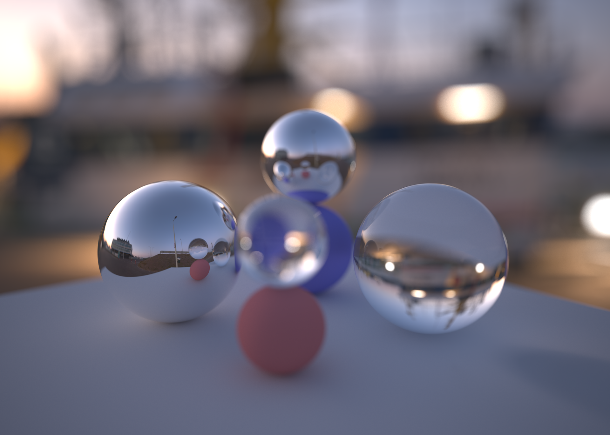
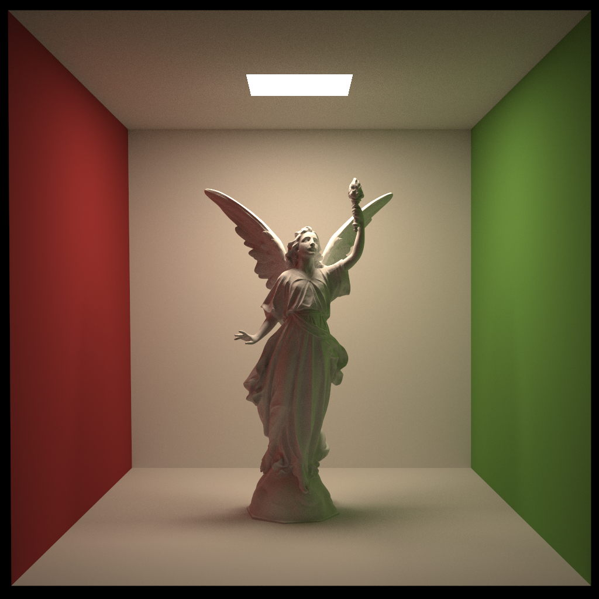
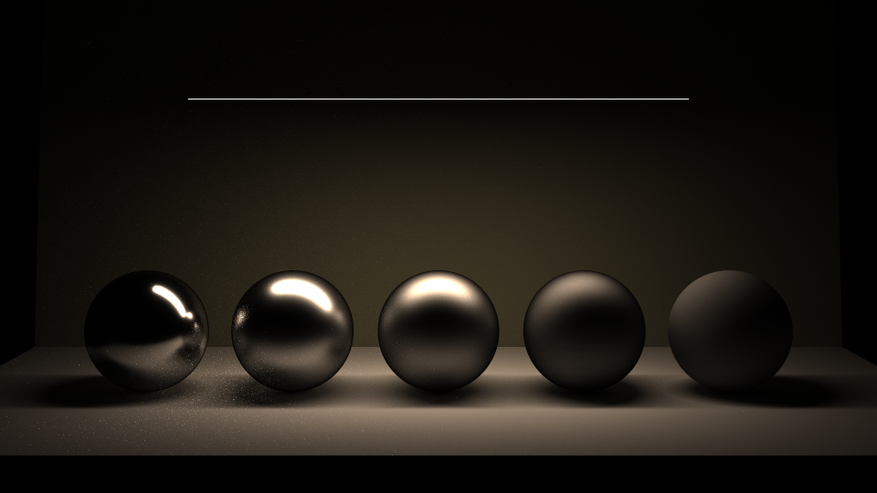

# Lumilly Render

Monte Carlo path tracing implementation on Rust



2102x1500 (1920x1370) 10000 samples per pixel

## Run

```
RUSTFLAGS='--emit asm -C target-feature=+avx' cargo run --release
```

## Feature

- Light transport
  - pt (Pure path-tracing)
  - pt-direct (Next event estimation)
- Acceleration structure
  - BVH (SAH)
- BSDF
  - Lambert
  - Phong
  - BlinnPhong
  - GGX [Walter et al. 2007]
- Camera
  - Ideal pinhole
  - Realistic pinhole
  - Thin lens model
- Mesh
  - Wavefront .obj (.mtl)
  - Sphere
- Sky
  - Uniform
  - Image based lighting
- Output
  - png
  - hdr
- Scene file support (scenes/*.toml)

## Gallery



1024x1024 512 samples per pixel



960x540 4096 samples per pixel

## References

- [Walter et al. 2007, “Microfacet Models for Refraction through Rough Surfaces”, Eurographics Symposium on Rendering.](https://www.cs.cornell.edu/~srm/publications/EGSR07-btdf.pdf)
